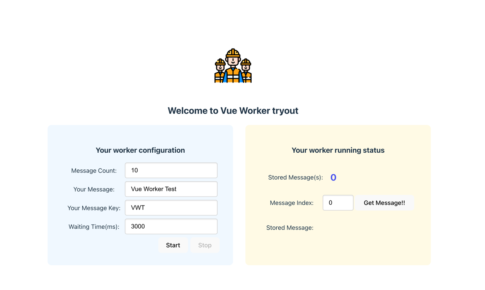

# Vue Worker tryout
This repository is for worker tryout. Vite + vue3 is this project base.

## How to run
```shell
npm run dev
```

## Application UI


## How to use
In a left side or screen, there are some configurations to run this sample application.
Default values has been filled in already so please click "Start" button simply.

Then, the result will be applied to the right side of screen.
Worker thread continue to generate messages and you can access message objects whenever you like.
